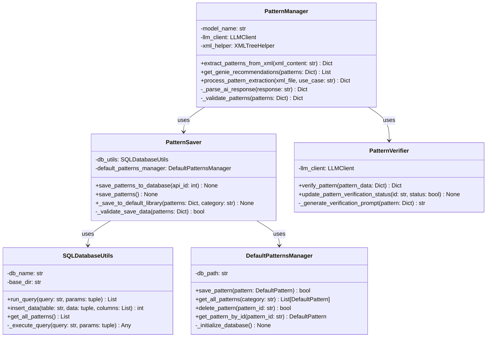
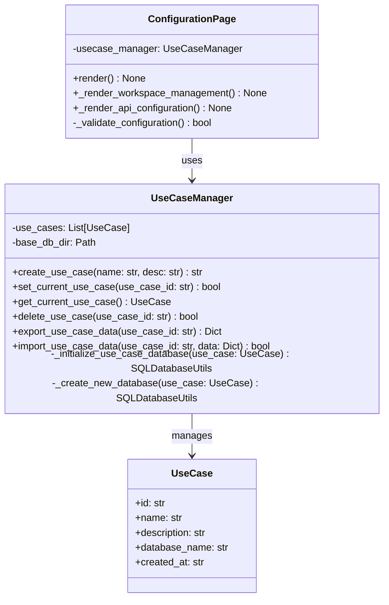
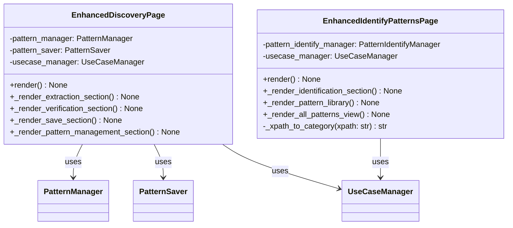
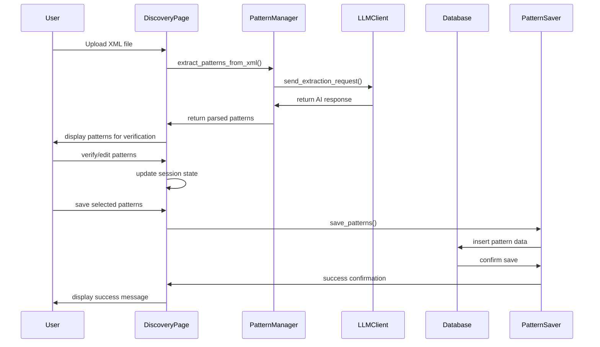
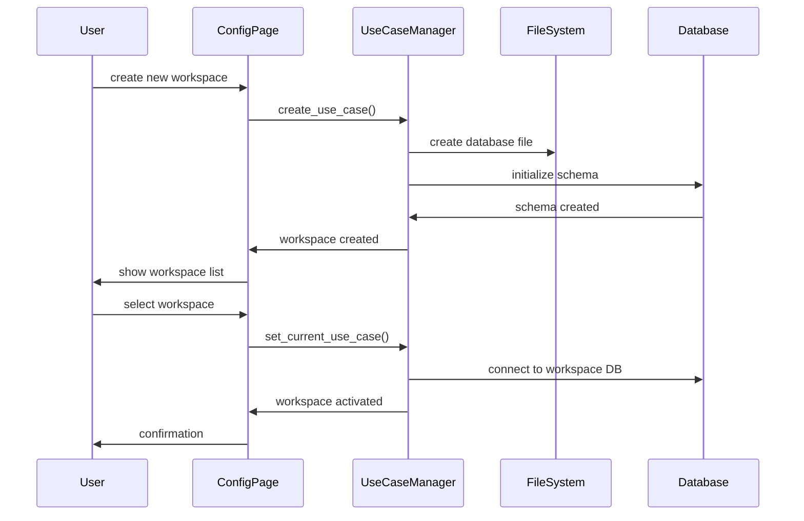
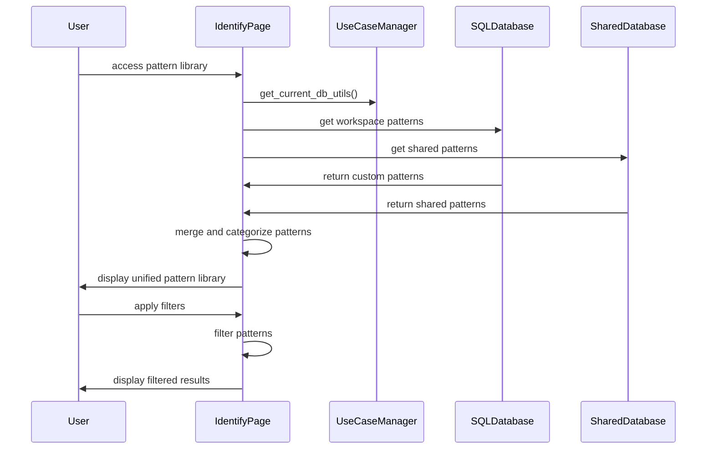

# AssistedDiscovery - Comprehensive Technical Documentation

## Table of Contents

1. [Project Overview](#project-overview)
2. [System Architecture](#system-architecture)
3. [Database Design](#database-design)
4. [Core Components](#core-components)
5. [User Interface Layer](#user-interface-layer)
6. [API Integration](#api-integration)
7. [Data Flow](#data-flow)
8. [Security Implementation](#security-implementation)
9. [Configuration Management](#configuration-management)
10. [File Structure](#file-structure)
11. [Class Diagrams](#class-diagrams)
12. [Workflow Diagrams](#workflow-diagrams)
13. [Installation & Setup](#installation-setup)
14. [Usage Guide](#usage-guide)
15. [Troubleshooting](#troubleshooting)
16. [Performance Considerations](#performance-considerations)
17. [Future Enhancements](#future-enhancements)

---

## Project Overview

### Purpose
AssistedDiscovery is an AI-powered Streamlit web application designed for XML pattern analysis and discovery. It enables users to extract, verify, manage, and share XML patterns using Large Language Model (LLM) assistance, specifically OpenAI's GPT models.

### Key Features
- **AI-Powered Pattern Extraction**: Uses GPT models to automatically identify patterns in XML files
- **Multi-Workspace Support**: Isolated workspaces for different projects/teams
- **Pattern Verification**: Manual verification and editing of AI-extracted patterns
- **Dual Storage System**: Personal workspace patterns and shared team patterns
- **Pattern Library**: Comprehensive browsing and filtering of all patterns
- **Export/Import**: Data portability across workspaces
- **Real-time Analysis**: Interactive XML pattern identification

### Technology Stack
- **Frontend**: Streamlit (Python web framework)
- **Backend**: Python 3.8+
- **Database**: SQLite3 (multiple database instances)
- **AI/ML**: OpenAI GPT-4 API
- **Data Processing**: pandas, lxml
- **Version Control**: Git with GitHub integration

---

## System Architecture

### High-Level Architecture

```
┌─────────────────────────────────────────────────────────────┐
│                    Streamlit Web Interface                  │
├─────────────────────────────────────────────────────────────┤
│  Configuration  │    Discovery    │     Identify           │
│      Page       │      Page       │      Page              │
└─────────────────┴─────────────────┴─────────────────────────┘
                           │
┌─────────────────────────────────────────────────────────────┐
│                     Core Application Layer                  │
├─────────────────────────────────────────────────────────────┤
│  Pattern Manager │ Pattern Saver  │ Pattern Verifier      │
│  Use Case Mgr    │ XML Processing │ LLM Integration       │
└─────────────────────────────────────────────────────────────┘
                           │
┌─────────────────────────────────────────────────────────────┐
│                    Data Storage Layer                       │
├─────────────────────────────────────────────────────────────┤
│  Workspace DBs   │ Shared Patterns│ Configuration         │
│  (SQLite)        │ DB (SQLite)    │ Files                 │
└─────────────────────────────────────────────────────────────┘
                           │
┌─────────────────────────────────────────────────────────────┐
│                    External Services                        │
├─────────────────────────────────────────────────────────────┤
│     OpenAI API   │   File System  │   Environment Vars    │
└─────────────────────────────────────────────────────────────┘
```

### Component Interactions

1. **User Interface Layer**: Streamlit pages handle user interactions
2. **Business Logic Layer**: Core modules process requests and coordinate operations
3. **Data Access Layer**: Database utilities manage data persistence
4. **External Integration Layer**: API clients handle external service communication

---

## Database Design

### Database Architecture

The system uses multiple SQLite databases:

#### 1. Workspace Databases (`{workspace_name}.db`)
Each workspace has its own isolated database with the following schema:

```sql
-- API definitions
CREATE TABLE api (
    api_id INTEGER PRIMARY KEY AUTOINCREMENT,
    api_name TEXT NOT NULL UNIQUE,
    created_at TEXT DEFAULT CURRENT_TIMESTAMP,
    updated_at TEXT DEFAULT CURRENT_TIMESTAMP
);

-- API version tracking
CREATE TABLE apiversion (
    version_id INTEGER PRIMARY KEY AUTOINCREMENT,
    api_id INTEGER,
    version_number TEXT NOT NULL,
    created_at TEXT DEFAULT CURRENT_TIMESTAMP,
    updated_at TEXT DEFAULT CURRENT_TIMESTAMP,
    FOREIGN KEY (api_id) REFERENCES api (api_id)
);

-- API sections/endpoints
CREATE TABLE api_section (
    section_id INTEGER PRIMARY KEY AUTOINCREMENT,
    api_id INTEGER NOT NULL,
    section_name TEXT NOT NULL,
    section_display_name TEXT NOT NULL UNIQUE,
    created_at TEXT DEFAULT CURRENT_TIMESTAMP,
    updated_at TEXT DEFAULT CURRENT_TIMESTAMP,
    FOREIGN KEY (api_id) REFERENCES api(api_id)
);

-- Pattern definitions
CREATE TABLE pattern_details (
    pattern_id INTEGER PRIMARY KEY AUTOINCREMENT,
    pattern_name TEXT NOT NULL UNIQUE,
    pattern_description TEXT,
    pattern_prompt TEXT,
    created_at TEXT DEFAULT CURRENT_TIMESTAMP,
    updated_at TEXT DEFAULT CURRENT_TIMESTAMP
);

-- Relationships between patterns and sections
CREATE TABLE section_pattern_mapping (
    mapping_id INTEGER PRIMARY KEY AUTOINCREMENT,
    pattern_id INTEGER NOT NULL,
    section_id INTEGER NOT NULL,
    api_id INTEGER NOT NULL,
    created_at TEXT DEFAULT CURRENT_TIMESTAMP,
    updated_at TEXT DEFAULT CURRENT_TIMESTAMP,
    FOREIGN KEY (pattern_id) REFERENCES pattern_details(pattern_id),
    FOREIGN KEY (section_id) REFERENCES api_section(section_id),
    FOREIGN KEY (api_id) REFERENCES api(api_id)
);
```

#### 2. Shared Patterns Database (`default_patterns.db`)
Global shared patterns accessible across all workspaces:

```sql
CREATE TABLE default_patterns (
    pattern_id TEXT PRIMARY KEY,
    name TEXT NOT NULL,
    description TEXT,
    prompt TEXT NOT NULL,
    example TEXT,
    xpath TEXT,
    category TEXT DEFAULT 'default',
    created_at TEXT DEFAULT CURRENT_TIMESTAMP,
    updated_at TEXT DEFAULT CURRENT_TIMESTAMP,
    is_active BOOLEAN DEFAULT 1
);

CREATE INDEX idx_category_active ON default_patterns (category, is_active);
```

### Database Relationships

```
┌─────────────────┐
│       api       │
│  - api_id (PK)  │
│  - api_name     │
└─────────┬───────┘
          │ 1:N
          ▼
┌─────────────────┐    ┌─────────────────┐
│   apiversion    │    │   api_section   │
│ - version_id    │    │ - section_id    │
│ - api_id (FK)   │    │ - api_id (FK)   │
│ - version_num   │    │ - section_name  │
└─────────────────┘    └─────────┬───────┘
                                 │ 1:N
                                 ▼
┌─────────────────┐    ┌─────────────────┐
│ pattern_details │    │section_pattern_ │
│ - pattern_id    │◄──►│    mapping      │
│ - pattern_name  │N:M │ - pattern_id    │
│ - description   │    │ - section_id    │
└─────────────────┘    │ - api_id        │
                       └─────────────────┘
```

---

## Core Components

### 1. Pattern Management (`core/assisted_discovery/`)

#### PatternManager (`pattern_manager.py`)
**Purpose**: Core pattern extraction and AI integration

**Key Methods**:
```python
def extract_patterns_from_xml(self, xml_content: str, use_case: str) -> Dict
def get_genie_recommendations(self, patterns: Dict) -> List[str]
def process_pattern_extraction(self, xml_file, selected_use_case: str) -> Dict
```

**Responsibilities**:
- XML parsing and analysis
- AI-powered pattern extraction
- Genie recommendation generation
- Pattern validation and formatting

#### PatternSaver (`pattern_saver.py`)
**Purpose**: Handles saving patterns to different storage locations

**Key Methods**:
```python
def save_patterns_to_database(self, selected_api_id: int) -> None
def save_patterns(self) -> None
def _save_to_default_library(self, patterns_dict: Dict, category: str) -> None
```

**Features**:
- Individual pattern selection
- API management
- Dual saving modes (personal workspace/shared workspace)
- Pattern categorization

#### PatternVerifier (`pattern_verifier.py`)
**Purpose**: Pattern verification and validation logic

**Key Methods**:
```python
def verify_pattern(self, pattern_data: Dict) -> Dict
def update_pattern_verification_status(self, pattern_id: str, status: bool) -> None
```

### 2. Database Management (`core/database/`)

#### SQLDatabaseUtils (`sql_db_utils.py`)
**Purpose**: Database operations for workspace-specific data

**Key Methods**:
```python
def run_query(self, query: str, params: tuple = None) -> List
def insert_data(self, table: str, data: tuple, columns: List[str] = None) -> int
def get_all_patterns(self) -> List
def insert_api_version(self, api_id: int, version: str) -> None
```

#### DefaultPatternsManager (`default_patterns_manager.py`)
**Purpose**: Manages shared patterns across all workspaces

**Key Methods**:
```python
def save_pattern(self, pattern: DefaultPattern) -> bool
def get_all_patterns(self, category: str = None) -> List[DefaultPattern]
def delete_pattern(self, pattern_id: str) -> bool
def get_pattern_by_id(self, pattern_id: str) -> Optional[DefaultPattern]
```

**Data Model**:
```python
@dataclass
class DefaultPattern:
    pattern_id: str
    name: str
    description: str
    prompt: str
    example: str
    xpath: str
    category: str = "default"
    created_at: Optional[str] = None
    updated_at: Optional[str] = None
    is_active: bool = True
```

### 3. Workspace Management (`core/common/`)

#### UseCaseManager (`usecase_manager.py`)
**Purpose**: Manages multiple workspaces and their isolation

**Key Methods**:
```python
def create_use_case(self, name: str, description: str) -> str
def set_current_use_case(self, use_case_id: str) -> bool
def get_current_use_case(self) -> Optional[UseCase]
def delete_use_case(self, use_case_id: str) -> bool
def export_use_case_data(self, use_case_id: str) -> Optional[Dict]
def import_use_case_data(self, use_case_id: str, data: Dict) -> bool
```

**Data Model**:
```python
@dataclass
class UseCase:
    id: str
    name: str
    description: str
    database_name: str
    created_at: str
```

#### Database Initialization Process:
1. Check if workspace database exists
2. Create database from schema if needed
3. Run schema migrations
4. Initialize database utilities
5. Set up workspace-specific configuration

### 4. LLM Integration (`core/llm/`)

#### LLMManager (`LLMManager.py`)
**Purpose**: Manages communication with OpenAI API

**Key Methods**:
```python
def generate_response(self, prompt: str, model: str = "gpt-4") -> str
def extract_patterns(self, xml_content: str, system_prompt: str) -> Dict
def verify_pattern(self, pattern: Dict, xml_sample: str) -> Dict
```

**Features**:
- API key management
- Error handling and retries
- Response parsing and validation
- Cost tracking

---

## User Interface Layer

### Streamlit Application Structure

#### 1. Configuration Page (`app/pages/0_Configuration.py`)
**Purpose**: System configuration and API key management

**Features**:
- API key configuration
- Workspace selection
- System settings
- Connection testing

**Key Components**:
```python
class ConfigurationPage:
    def render_api_configuration(self) -> None
    def render_workspace_selection(self) -> None
    def test_api_connections(self) -> bool
```

#### 2. Discovery Page (`app/pages/1_Discovery.py`)
**Purpose**: Pattern extraction and management workflow

**Features**:
- XML file upload
- Pattern extraction with AI
- Pattern verification interface
- Pattern saving (personal/shared)
- Pattern management tools

**Tab Structure**:
- **Extract**: XML upload and AI-powered pattern extraction
- **Verify**: Manual pattern verification and editing
- **Save**: Pattern saving with individual selection
- **Manage Custom Patterns**: Database pattern management
- **Manage Shared Patterns**: Shared workspace pattern management

**Key Methods**:
```python
def _render_extraction_section(self) -> None
def _render_verification_section(self) -> None
def _render_save_section(self) -> None
def _render_pattern_management_section(self) -> None
```

#### 3. Identify Page (`app/pages/2_Identify.py`)
**Purpose**: Pattern identification and library browsing

**Features**:
- XML analysis against known patterns
- Comprehensive pattern library
- Pattern filtering and search
- Export functionality

**Components**:
- **Identify Patterns**: Upload XML for pattern analysis
- **Pattern Library**: Browse all saved patterns

**Key Methods**:
```python
def _render_identification_section(self) -> None
def _render_all_patterns_view(self) -> None
def _xpath_to_category(self, xpath: str) -> str
```

### UI Design Patterns

#### Consistent Styling
```python
# CSS classes and styling patterns
def load_css():
    """Load CSS with enhanced reliability"""
    from core.common.streamlit_css_loader import load_streamlit_css
    load_streamlit_css()
```

#### Error Handling
```python
@streamlit_error_handler
def render(self):
    """Error-wrapped rendering with logging"""
    setup_global_exception_handler()
    # Component rendering logic
```

#### State Management
```python
# Session state patterns
if 'pattern_responses' not in st.session_state:
    st.session_state.pattern_responses = {}

if 'current_use_case' not in st.session_state:
    st.session_state.current_use_case = None
```

---

## API Integration

### OpenAI Integration

#### Configuration
```python
class LLMClient:
    def __init__(self, api_key: str, model: str = "gpt-4"):
        self.client = OpenAI(api_key=api_key)
        self.model = model
        self.cost_tracker = CostDisplayManager()
```

#### Pattern Extraction Workflow
```python
def extract_patterns(self, xml_content: str) -> Dict:
    """
    1. Prepare system prompt for pattern extraction
    2. Send XML content to GPT-4
    3. Parse JSON response
    4. Validate pattern structure
    5. Return formatted patterns
    """
    system_prompt = self._load_extraction_prompt()
    response = self.client.chat.completions.create(
        model=self.model,
        messages=[
            {"role": "system", "content": system_prompt},
            {"role": "user", "content": xml_content}
        ]
    )
    return self._parse_pattern_response(response)
```

#### Error Handling
```python
def handle_api_error(self, error: Exception) -> Dict:
    """Handle various OpenAI API errors"""
    if isinstance(error, openai.RateLimitError):
        return {"error": "Rate limit exceeded", "retry_after": 60}
    elif isinstance(error, openai.InvalidRequestError):
        return {"error": "Invalid request format"}
    # Additional error handling...
```

---

## Data Flow

### Pattern Extraction Flow

```
User Uploads XML
       │
       ▼
Extract Patterns (AI)
       │
       ▼
Parse AI Response
       │
       ▼
Store in Session State
       │
       ▼
Display for Verification
       │
       ▼
User Verifies/Edits
       │
       ▼
Save Selected Patterns
    │           │
    ▼           ▼
Personal    Shared
Workspace   Workspace
```

### Database Operations Flow

```
Pattern Save Request
       │
       ▼
Validate Input Data
       │
       ▼
Begin Transaction
       │
       ▼
Insert API Section
       │
       ▼
Insert Pattern Details
       │
       ▼
Create Section Mapping
       │
       ▼
Commit Transaction
       │
       ▼
Update UI State
```

### Workspace Management Flow

```
Create Workspace
       │
       ▼
Generate Unique ID
       │
       ▼
Create Database File
       │
       ▼
Initialize Schema
       │
       ▼
Set Current Context
       │
       ▼
Update Session State
```

---

## Security Implementation

### API Key Management

#### Environment Variables
```python
# .env file structure
OPENAI_API_KEY=sk-...
ATLASSIAN_API_KEY=...
```

#### Secure Loading
```python
class EnvManager:
    def __init__(self):
        load_dotenv()
        self.required_keys = ['OPENAI_API_KEY']
    
    def validate_keys(self) -> List[str]:
        """Return list of missing required keys"""
        missing = []
        for key in self.required_keys:
            if not os.getenv(key):
                missing.append(key)
        return missing
```

### Data Protection

#### Database Security
- Each workspace has isolated database
- No cross-workspace data access
- Proper SQL parameter binding to prevent injection

#### File System Security
```python
# Secure file path handling
def sanitize_filename(filename: str) -> str:
    """Remove potentially dangerous characters"""
    return "".join(c for c in filename if c.isalnum() or c in (' ', '-', '_', '.'))

def validate_file_extension(filename: str, allowed: List[str]) -> bool:
    """Validate file extensions"""
    return filename.lower().endswith(tuple(allowed))
```

### Git Security

#### .gitignore Configuration
```gitignore
# API Keys and Sensitive Configuration
*.env
.env*
**/api_keys.json
*openai*key*
*atlassian*key*

# Database files
*.db
*.sqlite
*.sqlite3

# Logs and temporary files
*.log
logs/
*.tmp
```

---

## Configuration Management

### Application Configuration

#### Streamlit Configuration (`.streamlit/config.toml`)
```toml
[server]
headless = true
port = 8501
enableCORS = false

[theme]
primaryColor = "#1f77b4"
backgroundColor = "#ffffff"
secondaryBackgroundColor = "#f0f2f6"
textColor = "#262730"
```

#### Environment Configuration
```python
class ConfigManager:
    def __init__(self):
        self.config = {
            'MODEL_NAME': os.getenv('MODEL_NAME', 'gpt-4'),
            'MAX_TOKENS': int(os.getenv('MAX_TOKENS', '4000')),
            'TEMPERATURE': float(os.getenv('TEMPERATURE', '0.1')),
            'DATABASE_DIR': os.getenv('DATABASE_DIR', 'core/database/data')
        }
```

### Prompt Management

#### System Prompts Structure
```
core/config/prompts/generic/
├── default_system_prompt_for_pattern_extraction.md
├── default_system_prompt_for_pattern_verification.md
├── default_system_prompt_for_gap_analysis.md
└── default_system_prompt_for_pattern_insights.md
```

#### Dynamic Prompt Loading
```python
class PromptManager:
    def load_prompt(self, prompt_type: str, use_case: str = 'generic') -> str:
        """Load prompt template with use-case specific customization"""
        base_path = f"core/config/prompts/{use_case}"
        prompt_file = f"{base_path}/{prompt_type}.md"
        
        with open(prompt_file, 'r') as f:
            return f.read()
```

---

## File Structure

### Complete Project Structure

```
AssistedDiscovery/
├── .git/                              # Git repository data
├── .gitignore                         # Git ignore patterns
├── .env                              # Environment variables (excluded)
├── .env.example                      # Environment template
├── README.md                         # Project overview
├── TECHNICAL_DOCUMENTATION.md        # This document
├── requirements.txt                  # Python dependencies
├── streamlit_launcher.py             # Application launcher
├── test_css_loading.py               # CSS testing utility
├── build_portable.sh                # Portable build script (Unix)
├── build_portable.bat               # Portable build script (Windows)
│
├── .streamlit/                       # Streamlit configuration
│   └── config.toml                   # Streamlit settings
│
├── app/                              # Streamlit application
│   ├── __init__.py
│   ├── Assisted_Discovery.py         # Main application entry
│   ├── agents.py                     # Agent definitions
│   ├── css/
│   │   └── table_styles.css          # Custom CSS styles
│   └── pages/                        # Application pages
│       ├── 0_Configuration.py        # Configuration page
│       ├── 1_Discovery.py            # Pattern discovery page
│       └── 2_Identify.py             # Pattern identification page
│
├── core/                             # Core application logic
│   ├── __init__.py
│   │
│   ├── assisted_discovery/           # Pattern discovery modules
│   │   ├── __init__.py
│   │   ├── agents.py                 # AI agents
│   │   ├── gap_analysis_manager.py   # Gap analysis logic
│   │   ├── identify_pattern_manager.py # Pattern identification
│   │   ├── pattern_manager.py        # Core pattern management
│   │   ├── pattern_saver.py          # Pattern saving logic
│   │   ├── pattern_verifier.py       # Pattern verification
│   │   ├── specification_file_manager.py # Spec file handling
│   │   └── xml_tree_helper.py        # XML processing utilities
│   │
│   ├── common/                       # Shared utilities
│   │   ├── __init__.py
│   │   ├── api_key_manager.py        # API key management
│   │   ├── confluence_utils.py       # Confluence integration
│   │   ├── constants.py              # Application constants
│   │   ├── cost_display_manager.py   # Cost tracking
│   │   ├── css_utils.py              # CSS utilities
│   │   ├── env_manager.py            # Environment management
│   │   ├── error_tracker.py          # Error tracking
│   │   ├── logging_manager.py        # Logging utilities
│   │   ├── streamlit_css_loader.py   # CSS loading
│   │   ├── ui_utils.py               # UI utilities
│   │   ├── usecase_manager.py        # Workspace management
│   │   ├── user_interaction.py       # User interaction helpers
│   │   ├── utils.py                  # General utilities
│   │   └── utils_ref.py              # Reference utilities
│   │
│   ├── config/                       # Configuration files
│   │   ├── cookbooks/
│   │   │   └── xslt_cookbook.md      # XSLT documentation
│   │   ├── data/
│   │   │   ├── specs_qna.json        # Q&A specifications
│   │   │   └── specs_qna_1.json      # Additional specifications
│   │   ├── prompts/                  # AI prompts
│   │   │   ├── generic/              # Generic prompts
│   │   │   ├── NDC/                  # NDC-specific prompts
│   │   │   ├── Navitaire/            # Navitaire-specific prompts
│   │   │   └── SWG/                  # SWG-specific prompts
│   │   ├── results/                  # Generated results
│   │   └── test_data/                # Test XML files
│   │       ├── LATAM/                # LATAM test data
│   │       ├── MTE/                  # MTE test data
│   │       ├── NDC/                  # NDC test data
│   │       ├── Navitaire/            # Navitaire test data
│   │       └── OrderCreate/          # Order creation test data
│   │
│   ├── data_processing/              # Data processing utilities
│   │   ├── __init__.py
│   │   └── cleanup.py                # Data cleanup utilities
│   │
│   ├── database/                     # Database management
│   │   ├── __init__.py
│   │   ├── configure_llama_chroma_database.py # Vector DB setup
│   │   ├── configure_llama_database.py        # LLM DB setup
│   │   ├── database_utils.py         # Database utilities
│   │   ├── default_patterns_manager.py # Shared patterns
│   │   ├── generated.xslt            # Generated XSLT
│   │   ├── llamaIndex.py             # LlamaIndex integration
│   │   ├── schema_migration.py       # Database migrations
│   │   ├── sql_db_utils.py           # SQL utilities
│   │   └── data/                     # Database files and schema
│   │       ├── API table.sql         # Database schema
│   │       ├── default_patterns/     # Default pattern definitions
│   │       └── *.db                  # SQLite database files (excluded)
│   │
│   ├── hive/                         # Hive integration
│   │   ├── __init__.py
│   │   ├── core.py                   # Hive core functionality
│   │   ├── types.py                  # Type definitions
│   │   ├── util.py                   # Utilities
│   │   └── repl/                     # REPL implementation
│   │       ├── __init__.py
│   │       └── repl.py               # REPL logic
│   │
│   ├── llm/                          # LLM integration
│   │   ├── __init__.py
│   │   ├── LLMAgent.py               # LLM agent wrapper
│   │   ├── LLMClient.py              # LLM client
│   │   ├── LLMManager.py             # LLM management
│   │   ├── llm_response_handler_utils.py # Response handling
│   │   ├── llm_utils.py              # LLM utilities
│   │   └── relevance_checker.py      # Relevance checking
│   │
│   ├── prompts_manager/              # Prompt management
│   │   ├── __init__.py
│   │   ├── gap_analysis_prompt_manager.py # Gap analysis prompts
│   │   ├── prompt_manager.py         # Core prompt management
│   │   ├── prompt_utils.py           # Prompt utilities
│   │   ├── xslt_migrator_prompt_manager.py # XSLT migration prompts
│   │   └── xslt_update_prompt_manager.py   # XSLT update prompts
│   │
│   ├── search/                       # Search functionality
│   │   ├── __init__.py
│   │   └── azure_search_manager.py   # Azure search integration
│   │
│   ├── xml_processing/               # XML processing
│   │   ├── __init__.py
│   │   ├── Filechunker.py            # File chunking
│   │   ├── xml_tree_parser.py        # XML parsing
│   │   └── xml_utils.py              # XML utilities
│   │
│   └── xslt/                         # XSLT processing
│       ├── __init__.py
│       ├── xslt_utils.py             # XSLT utilities
│       └── xslt_utils_ref.py         # XSLT reference utilities
```

### Key File Descriptions

#### Application Entry Points
- `streamlit_launcher.py`: Main application launcher
- `app/Assisted_Discovery.py`: Streamlit application main page
- `app/pages/*.py`: Individual application pages

#### Core Modules
- `core/assisted_discovery/pattern_manager.py`: Primary pattern extraction logic
- `core/common/usecase_manager.py`: Workspace management
- `core/database/sql_db_utils.py`: Database operations
- `core/database/default_patterns_manager.py`: Shared pattern management

#### Configuration
- `.env`: Environment variables (excluded from git)
- `.streamlit/config.toml`: Streamlit configuration
- `core/config/prompts/`: AI prompt templates

---

## Class Diagrams

### Core Pattern Management Classes



### Workspace Management Classes



### UI Layer Classes



---

## Workflow Diagrams

### Pattern Discovery Workflow



### Workspace Management Workflow



### Pattern Library Access Workflow



---

## Installation & Setup

### Prerequisites

#### System Requirements
- **Operating System**: Windows 10+, macOS 10.14+, or Linux
- **Python**: 3.8 or higher
- **Memory**: Minimum 4GB RAM (8GB recommended)
- **Storage**: 1GB free space
- **Network**: Internet connection for AI API calls

#### Required Services
- **OpenAI API Account**: For GPT-4 access
- **Git**: For version control (optional)

### Installation Process

#### 1. Clone Repository
```bash
git clone https://github.com/krinik/AssistedDiscovery.git
cd AssistedDiscovery
```

#### 2. Create Virtual Environment
```bash
# Create virtual environment
python -m venv venv

# Activate virtual environment
# On Windows:
venv\Scripts\activate
# On macOS/Linux:
source venv/bin/activate
```

#### 3. Install Dependencies
```bash
pip install -r requirements.txt
```

#### 4. Environment Configuration
```bash
# Copy environment template
cp .env.example .env

# Edit .env file with your API keys
# Required:
OPENAI_API_KEY=your_openai_api_key_here

# Optional:
ATLASSIAN_API_KEY=your_atlassian_key_here
MODEL_NAME=gpt-4
MAX_TOKENS=4000
TEMPERATURE=0.1
```

#### 5. Initialize Database
```bash
# The application will automatically create databases on first run
# No manual database setup required
```

#### 6. Launch Application
```bash
streamlit run app/0_⚙️_Configuration.py
```

### Development Setup

#### Additional Development Dependencies
```bash
pip install pytest black flake8 mypy
```

#### Pre-commit Hooks (Optional)
```bash
pip install pre-commit
pre-commit install
```

#### Running Tests
```bash
pytest tests/
```

---

## Usage Guide

### Initial Setup

#### 1. Configuration
1. Launch the application
2. Navigate to Configuration page
3. Enter OpenAI API key
4. Test API connection
5. Create or select workspace

#### 2. First Workspace
```python
# Workspace creation process:
1. Click "Create New Workspace"
2. Enter workspace name (e.g., "LATAM_Analysis")
3. Enter description
4. Click "Create"
5. Select newly created workspace
```

### Pattern Discovery Workflow

#### 1. Extract Patterns
1. Navigate to Discovery page
2. Go to "Extract" tab
3. Upload XML file
4. Click "Extract Patterns with Genie"
5. Wait for AI processing
6. Review extracted patterns

#### 2. Verify Patterns
1. Go to "Verify" tab
2. Review each pattern:
   - Check pattern name
   - Verify description
   - Validate XPath
   - Edit if necessary
3. Mark patterns as verified

#### 3. Save Patterns
1. Go to "Save" tab
2. Select patterns to save:
   - **Personal Workspace**: Individual pattern selection
   - **Shared Workspace**: Team collaboration patterns
3. Configure API and version
4. Choose appropriate category
5. Click save

### Pattern Management

#### Custom Pattern Management
1. Go to "Manage Custom Patterns" tab
2. View saved database patterns
3. Filter by API/section
4. Delete unwanted patterns
5. Edit categories (coming soon)

#### Shared Pattern Management
1. Go to "Manage Shared Patterns" tab
2. Browse team patterns by category
3. Search and filter patterns
4. Delete inappropriate patterns

### Pattern Identification

#### Analyze New XML
1. Navigate to Identify page
2. Go to "Identify Patterns" tab
3. Upload XML file for analysis
4. Click "Start Pattern Analysis"
5. Review identified patterns

#### Browse Pattern Library
1. Go to "Pattern Library" tab
2. View all saved patterns
3. Filter by:
   - Source (Shared Workspace, Custom API)
   - Category (Flight, Passenger, Fare, etc.)
   - Status (Shared, Saved)
4. Export filtered results

### Advanced Features

#### Workspace Export/Import
```python
# Export workspace data
workspace_data = usecase_manager.export_use_case_data("workspace_id")

# Import to new workspace
success = usecase_manager.import_use_case_data("new_workspace_id", workspace_data)
```

#### Custom Categories
When saving to shared workspace:
1. Select predefined category OR
2. Choose "Custom" and enter new category name
3. New categories become available for future use

#### Pattern Search and Filtering
- **Text search**: Search in pattern names and descriptions
- **Category filtering**: Filter by functional categories
- **Source filtering**: Separate workspace vs shared patterns
- **Status filtering**: Verified vs unverified patterns

---

## Troubleshooting

### Common Issues

#### 1. API Connection Issues

**Problem**: "OpenAI API key not found" or connection errors

**Solution**:
```bash
# Check environment variables
echo $OPENAI_API_KEY  # Linux/Mac
echo %OPENAI_API_KEY%  # Windows

# Verify .env file exists and contains:
OPENAI_API_KEY=sk-your-key-here

# Test API key validity
curl -H "Authorization: Bearer YOUR_API_KEY" \
     https://api.openai.com/v1/models
```

#### 2. Database Issues

**Problem**: "Database locked" or schema errors

**Solution**:
```python
# Delete corrupted database
import os
os.remove("core/database/data/workspace_name.db")

# Restart application - database will be recreated
```

#### 3. Pattern Extraction Failures

**Problem**: AI returns empty or invalid patterns

**Causes & Solutions**:
- **Invalid XML**: Validate XML syntax
- **XML too large**: Split into smaller chunks
- **API timeout**: Reduce XML size or increase timeout
- **Prompt issues**: Check system prompts in `core/config/prompts/`

#### 4. UI Issues

**Problem**: Streamlit interface not loading correctly

**Solution**:
```bash
# Clear Streamlit cache
streamlit cache clear

# Restart with verbose logging
streamlit run app/0_⚙️_Configuration.py --logger.level=debug

# Check CSS loading
python test_css_loading.py
```

#### 5. Permission Issues

**Problem**: File access denied or database permission errors

**Solution**:
```bash
# Check file permissions
ls -la core/database/data/

# Fix permissions (Linux/Mac)
chmod 755 core/database/data/
chmod 644 core/database/data/*.db

# Windows: Right-click folder → Properties → Security → Full Control
```

### Debug Mode

#### Enable Debug Logging
```python
import logging
logging.basicConfig(level=logging.DEBUG)

# Or set environment variable
export STREAMLIT_LOGGER_LEVEL=debug
```

#### Session State Debugging
```python
# Add to any page for debugging
st.write("Session State Debug:")
st.write(st.session_state)

# Check specific keys
if 'pattern_responses' in st.session_state:
    st.write(f"Patterns in session: {len(st.session_state.pattern_responses)}")
```

### Performance Issues

#### Large XML Files
```python
# XML chunking for large files
from core.xml_processing.Filechunker import FileChunker

chunker = FileChunker(max_chunk_size=100000)  # 100KB chunks
chunks = chunker.chunk_xml_content(xml_content)

# Process chunks individually
for chunk in chunks:
    patterns = pattern_manager.extract_patterns_from_xml(chunk)
```

#### Database Optimization
```sql
-- Add indexes for better performance
CREATE INDEX idx_pattern_name ON pattern_details(pattern_name);
CREATE INDEX idx_api_section_name ON api_section(section_name);
CREATE INDEX idx_created_at ON pattern_details(created_at);

-- Vacuum database to reclaim space
VACUUM;
```

### Error Recovery

#### Corrupted Session State
```python
# Clear problematic session state
if st.button("Clear Session State"):
    for key in list(st.session_state.keys()):
        del st.session_state[key]
    st.rerun()
```

#### Database Recovery
```python
# Database integrity check
import sqlite3
conn = sqlite3.connect('database_file.db')
conn.execute('PRAGMA integrity_check')
result = conn.fetchall()
print(result)  # Should return [('ok',)]
```

---

## Performance Considerations

### Optimization Strategies

#### 1. Database Performance

**Indexing Strategy**:
```sql
-- Essential indexes for pattern queries
CREATE INDEX IF NOT EXISTS idx_pattern_details_name 
    ON pattern_details(pattern_name);
CREATE INDEX IF NOT EXISTS idx_api_section_api_id 
    ON api_section(api_id);
CREATE INDEX IF NOT EXISTS idx_section_pattern_mapping_composite 
    ON section_pattern_mapping(pattern_id, section_id, api_id);

-- Default patterns optimization
CREATE INDEX IF NOT EXISTS idx_default_patterns_category_active 
    ON default_patterns(category, is_active);
CREATE INDEX IF NOT EXISTS idx_default_patterns_created_at 
    ON default_patterns(created_at);
```

**Query Optimization**:
```python
# Efficient pattern retrieval
def get_patterns_optimized(self, limit: int = 1000, offset: int = 0):
    """Paginated pattern retrieval with proper indexing"""
    query = """
    SELECT a.api_name, av.version_number, aps.section_name, 
           pd.pattern_description, pd.pattern_prompt
    FROM api a
    LEFT JOIN apiversion av ON a.api_id = av.api_id
    JOIN api_section aps ON a.api_id = aps.api_id
    JOIN section_pattern_mapping spm ON aps.section_id = spm.section_id
    JOIN pattern_details pd ON spm.pattern_id = pd.pattern_id
    ORDER BY pd.created_at DESC
    LIMIT ? OFFSET ?
    """
    return self.run_query(query, (limit, offset))
```

#### 2. Memory Management

**Session State Optimization**:
```python
# Efficient session state management
def optimize_session_state():
    """Clean up unused session state variables"""
    # Remove old pattern responses
    if 'pattern_responses' in st.session_state:
        # Keep only recent patterns (last 100)
        patterns = st.session_state.pattern_responses
        if len(patterns) > 100:
            # Keep most recent based on timestamp
            sorted_patterns = sorted(patterns.items(), 
                                   key=lambda x: x[1].get('timestamp', 0))
            st.session_state.pattern_responses = dict(sorted_patterns[-100:])
    
    # Clear temporary UI state
    temp_keys = [k for k in st.session_state.keys() if k.startswith('temp_')]
    for key in temp_keys:
        del st.session_state[key]
```

**Large XML Handling**:
```python
class XMLProcessor:
    def __init__(self, max_chunk_size: int = 50000):
        self.max_chunk_size = max_chunk_size
    
    def process_large_xml(self, xml_content: str) -> Dict:
        """Process large XML files in chunks"""
        if len(xml_content) > self.max_chunk_size:
            return self._process_chunked_xml(xml_content)
        else:
            return self._process_standard_xml(xml_content)
    
    def _process_chunked_xml(self, xml_content: str) -> Dict:
        """Break XML into manageable chunks"""
        from core.xml_processing.Filechunker import FileChunker
        
        chunker = FileChunker(self.max_chunk_size)
        chunks = chunker.chunk_xml_content(xml_content)
        
        all_patterns = {}
        for i, chunk in enumerate(chunks):
            chunk_patterns = self.pattern_manager.extract_patterns_from_xml(chunk)
            # Merge patterns with unique keys
            for key, pattern in chunk_patterns.items():
                unique_key = f"{key}_chunk_{i}"
                all_patterns[unique_key] = pattern
        
        return all_patterns
```

#### 3. API Rate Limiting

**Request Management**:
```python
import time
from datetime import datetime, timedelta

class RateLimitedLLMClient:
    def __init__(self, requests_per_minute: int = 60):
        self.requests_per_minute = requests_per_minute
        self.request_times = []
    
    def make_request(self, prompt: str) -> str:
        """Make rate-limited API request"""
        self._enforce_rate_limit()
        
        try:
            response = self.client.chat.completions.create(
                model=self.model,
                messages=[{"role": "user", "content": prompt}]
            )
            self.request_times.append(datetime.now())
            return response.choices[0].message.content
            
        except openai.RateLimitError:
            wait_time = self._calculate_wait_time()
            st.warning(f"Rate limit reached. Waiting {wait_time} seconds...")
            time.sleep(wait_time)
            return self.make_request(prompt)  # Retry
    
    def _enforce_rate_limit(self):
        """Ensure we don't exceed rate limits"""
        now = datetime.now()
        minute_ago = now - timedelta(minutes=1)
        
        # Remove old requests
        self.request_times = [t for t in self.request_times if t > minute_ago]
        
        # Wait if at limit
        if len(self.request_times) >= self.requests_per_minute:
            wait_time = 60 - (now - self.request_times[0]).seconds
            time.sleep(wait_time)
```

#### 4. UI Performance

**Lazy Loading**:
```python
def render_pattern_library_optimized(self):
    """Render pattern library with lazy loading"""
    # Pagination for large datasets
    page_size = 50
    page = st.number_input("Page", min_value=1, value=1) - 1
    
    # Load only current page
    patterns = self.get_patterns_paginated(
        limit=page_size, 
        offset=page * page_size
    )
    
    # Cache expensive operations
    @st.cache_data
    def process_patterns(pattern_data):
        """Cache pattern processing results"""
        return self._process_pattern_display_data(pattern_data)
    
    processed_patterns = process_patterns(tuple(patterns))
    self._render_pattern_table(processed_patterns)
```

**Streamlit Optimization**:
```python
# Use st.cache_data for expensive operations
@st.cache_data(ttl=300)  # Cache for 5 minutes
def load_shared_patterns():
    """Cache shared patterns loading"""
    manager = DefaultPatternsManager()
    return manager.get_all_patterns()

# Avoid unnecessary reruns
if 'patterns_loaded' not in st.session_state:
    st.session_state.patterns_loaded = False
    st.session_state.patterns_data = load_shared_patterns()
    st.session_state.patterns_loaded = True
```

### Monitoring and Metrics

#### Performance Monitoring
```python
import time
from functools import wraps

def performance_monitor(func):
    """Decorator to monitor function performance"""
    @wraps(func)
    def wrapper(*args, **kwargs):
        start_time = time.time()
        result = func(*args, **kwargs)
        end_time = time.time()
        
        execution_time = end_time - start_time
        
        # Log performance data
        logger.info(f"{func.__name__} executed in {execution_time:.2f} seconds")
        
        # Store in session state for monitoring
        if 'performance_data' not in st.session_state:
            st.session_state.performance_data = {}
        
        st.session_state.performance_data[func.__name__] = execution_time
        
        return result
    return wrapper

# Usage
@performance_monitor
def extract_patterns_from_xml(self, xml_content: str) -> Dict:
    # Function implementation
    pass
```

#### Cost Tracking
```python
class CostTracker:
    def __init__(self):
        self.costs = {
            'gpt-4': {'input': 0.03, 'output': 0.06},  # per 1K tokens
            'gpt-3.5-turbo': {'input': 0.001, 'output': 0.002}
        }
    
    def calculate_request_cost(self, model: str, input_tokens: int, output_tokens: int) -> float:
        """Calculate cost for API request"""
        if model not in self.costs:
            return 0.0
        
        input_cost = (input_tokens / 1000) * self.costs[model]['input']
        output_cost = (output_tokens / 1000) * self.costs[model]['output']
        
        return input_cost + output_cost
    
    def track_usage(self, model: str, input_tokens: int, output_tokens: int):
        """Track API usage and costs"""
        cost = self.calculate_request_cost(model, input_tokens, output_tokens)
        
        if 'usage_data' not in st.session_state:
            st.session_state.usage_data = {
                'total_cost': 0.0,
                'requests': 0,
                'tokens_used': 0
            }
        
        st.session_state.usage_data['total_cost'] += cost
        st.session_state.usage_data['requests'] += 1
        st.session_state.usage_data['tokens_used'] += input_tokens + output_tokens
```

---

## Future Enhancements

### Planned Features

#### 1. Advanced AI Integration

**Multi-Model Support**:
```python
class MultiModelLLMManager:
    def __init__(self):
        self.models = {
            'gpt-4': {'cost': 'high', 'quality': 'excellent'},
            'gpt-3.5-turbo': {'cost': 'low', 'quality': 'good'},
            'claude-3': {'cost': 'medium', 'quality': 'excellent'},
            'local-llama': {'cost': 'free', 'quality': 'moderate'}
        }
    
    def select_optimal_model(self, task_complexity: str, budget_limit: float) -> str:
        """Auto-select best model based on task and budget"""
        # Implementation for intelligent model selection
        pass
```

**Pattern Quality Scoring**:
```python
class PatternQualityAssessment:
    def assess_pattern_quality(self, pattern: Dict, xml_sample: str) -> Dict:
        """
        Assess pattern quality using multiple criteria:
        - XPath validity and specificity
        - Description clarity and completeness
        - Example relevance
        - Cross-validation against XML samples
        """
        return {
            'xpath_score': self._assess_xpath_quality(pattern['xpath']),
            'description_score': self._assess_description_quality(pattern['description']),
            'validation_score': self._validate_against_xml(pattern, xml_sample),
            'overall_score': 0.0,  # Calculated composite score
            'recommendations': []   # Improvement suggestions
        }
```

#### 2. Enhanced User Experience

**Real-time Collaboration**:
```python
class CollaborationManager:
    def __init__(self):
        self.active_users = {}
        self.pattern_locks = {}
    
    def enable_real_time_editing(self, pattern_id: str, user_id: str):
        """Enable real-time collaborative pattern editing"""
        # WebSocket integration for live updates
        # Conflict resolution mechanisms
        # User presence indicators
        pass
```

**Advanced Search and Analytics**:
```python
class PatternAnalytics:
    def generate_usage_insights(self) -> Dict:
        """Generate insights about pattern usage and effectiveness"""
        return {
            'most_used_patterns': self._get_popular_patterns(),
            'category_distribution': self._analyze_category_usage(),
            'quality_trends': self._analyze_quality_over_time(),
            'user_productivity': self._calculate_productivity_metrics()
        }
    
    def suggest_pattern_improvements(self, pattern_id: str) -> List[str]:
        """AI-powered suggestions for pattern improvement"""
        # Analyze similar patterns
        # Identify common issues
        # Generate improvement recommendations
        pass
```

#### 3. Enterprise Features

**Advanced Security**:
```python
class EnterpriseSecurityManager:
    def __init__(self):
        self.encryption_key = self._generate_encryption_key()
        self.audit_logger = AuditLogger()
    
    def encrypt_sensitive_data(self, data: str) -> str:
        """Encrypt sensitive pattern data"""
        # AES encryption for pattern data
        # Key rotation mechanisms
        # Secure key storage
        pass
    
    def log_security_event(self, event_type: str, user_id: str, details: Dict):
        """Log security-related events for compliance"""
        self.audit_logger.log_event({
            'timestamp': datetime.now(),
            'event_type': event_type,
            'user_id': user_id,
            'details': details,
            'ip_address': self._get_client_ip()
        })
```

**Role-Based Access Control**:
```python
class RBACManager:
    def __init__(self):
        self.roles = {
            'admin': ['create', 'read', 'update', 'delete', 'manage_users'],
            'editor': ['create', 'read', 'update'],
            'viewer': ['read'],
            'guest': ['read_public']
        }
    
    def check_permission(self, user_role: str, action: str, resource: str) -> bool:
        """Check if user has permission for specific action"""
        # Implement granular permission checking
        # Support for custom roles
        # Resource-level permissions
        pass
```

#### 4. Integration Enhancements

**API Development**:
```python
from fastapi import FastAPI, HTTPException
from pydantic import BaseModel

class PatternExtractionAPI:
    def __init__(self):
        self.app = FastAPI(title="AssistedDiscovery API")
        self._setup_routes()
    
    def _setup_routes(self):
        @self.app.post("/extract-patterns")
        async def extract_patterns(xml_data: XMLInput) -> PatternResponse:
            """RESTful API endpoint for pattern extraction"""
            # Implement API version of pattern extraction
            pass
        
        @self.app.get("/patterns/{pattern_id}")
        async def get_pattern(pattern_id: str) -> PatternDetail:
            """Get specific pattern by ID"""
            pass
```

**CI/CD Integration**:
```yaml
# .github/workflows/pattern-validation.yml
name: Pattern Validation Pipeline
on:
  pull_request:
    paths:
      - 'patterns/**'
      - 'core/**'

jobs:
  validate-patterns:
    runs-on: ubuntu-latest
    steps:
      - name: Validate Pattern Syntax
        run: python scripts/validate_patterns.py
      
      - name: Test Pattern Extraction
        run: pytest tests/test_pattern_extraction.py
      
      - name: Quality Gate Check
        run: python scripts/quality_gate.py
```

#### 5. Advanced Analytics

**Pattern Evolution Tracking**:
```python
class PatternEvolutionTracker:
    def track_pattern_changes(self, pattern_id: str, changes: Dict):
        """Track how patterns evolve over time"""
        # Version control for patterns
        # Change impact analysis
        # Rollback capabilities
        pass
    
    def analyze_pattern_performance(self, pattern_id: str) -> Dict:
        """Analyze pattern effectiveness over time"""
        return {
            'usage_frequency': self._get_usage_stats(pattern_id),
            'accuracy_metrics': self._calculate_accuracy(pattern_id),
            'user_feedback': self._aggregate_feedback(pattern_id),
            'improvement_suggestions': self._generate_suggestions(pattern_id)
        }
```

**Predictive Analytics**:
```python
class PredictiveAnalytics:
    def predict_pattern_utility(self, pattern_features: Dict) -> float:
        """Predict how useful a pattern will be"""
        # Machine learning model for pattern utility prediction
        # Features: complexity, domain, historical performance
        pass
    
    def recommend_patterns_for_xml(self, xml_content: str) -> List[str]:
        """Recommend existing patterns for new XML"""
        # Content-based recommendation system
        # Similarity analysis
        # Collaborative filtering
        pass
```

### Technical Roadmap

#### Phase 1: Core Enhancements (Q1-Q2)
- Multi-model LLM support
- Advanced pattern quality assessment
- Real-time collaboration features
- Enhanced security implementation

#### Phase 2: Enterprise Features (Q3)
- Role-based access control
- Audit logging and compliance
- API development
- Advanced analytics dashboard

#### Phase 3: AI/ML Integration (Q4)
- Pattern recommendation engine
- Automated quality improvement
- Predictive analytics
- Advanced search capabilities

#### Phase 4: Scalability (Year 2)
- Cloud deployment options
- Microservices architecture
- High-availability setup
- Performance optimization

### Contributing Guidelines

#### Development Setup
```bash
# Fork repository
git clone https://github.com/yourusername/AssistedDiscovery.git

# Create feature branch
git checkout -b feature/new-enhancement

# Install development dependencies
pip install -r requirements-dev.txt

# Run tests
pytest tests/

# Submit pull request
```

#### Code Standards
- Follow PEP 8 style guidelines
- Add comprehensive docstrings
- Include unit tests for new features
- Update documentation for changes
- Ensure backward compatibility

---

## Conclusion

AssistedDiscovery represents a comprehensive solution for AI-powered XML pattern analysis and management. The system's modular architecture, robust database design, and intuitive user interface make it suitable for both individual developers and enterprise teams.

The combination of advanced AI integration, flexible workspace management, and comprehensive pattern storage creates a powerful platform for XML analysis workflows. The detailed technical documentation provided here should serve as a complete reference for understanding, maintaining, and extending the system.

Key strengths of the system include:
- **Scalable Architecture**: Modular design supports easy extension
- **Robust Data Management**: Multiple database strategy ensures data integrity
- **User-Centric Design**: Streamlit interface provides excellent user experience
- **Security-First Approach**: Comprehensive security measures protect sensitive data
- **Comprehensive Documentation**: Detailed technical documentation supports maintenance

Future enhancements will focus on advanced AI capabilities, enterprise features, and improved collaboration tools, positioning AssistedDiscovery as a leading solution in the XML pattern analysis domain.

---

*This technical documentation is a living document and will be updated as the system evolves. For the latest information, please refer to the project repository and release notes.*

**Document Version**: 1.0  
**Last Updated**: August 1, 2025  
**Authors**: AssistedDiscovery Development Team